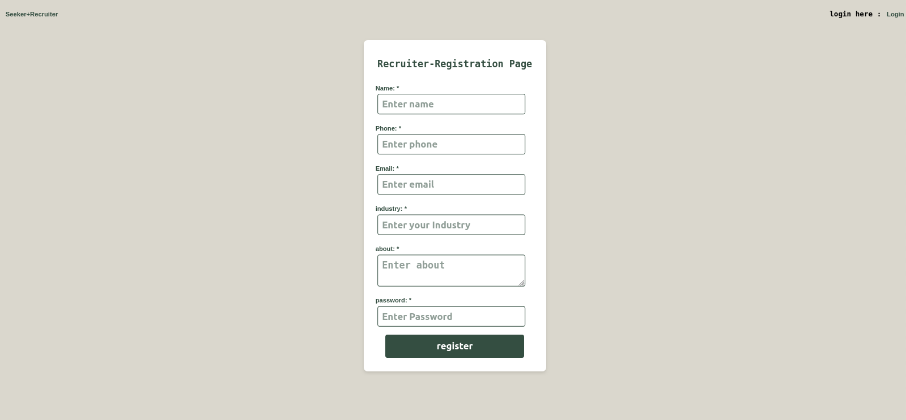

# Seekers_N_Recruiters
# About
It's a PHP-MySql Job Portal project where recruiter can post job and seeker can apply for job role based on requirements. It can seperate login/Registratriation page for seeker and recruiter.
## Glimpse





## Tools Used
    HTML
    CSS
    PHP
    MySQL
## Database

``` 

CREATE DATABASE IF NOT EXISTS JobPortal

CREATE TABLE IF NOT EXISTS seeker (
    id int(20) not null AUTO_INCREMENT primary key,
    name varchar(50) not null,
    email varchar(50) PRIMARY KEY not null,
    phone bigint(40) not null,
    college varchar(100) not null,
    course varchar(30) not null,
    about varchar(120) not null,
    experience int(20) DEFAULT 0,
    industry varchar(40),
    passw varchar(100) not null
)

CREATE TABLE if not exists recruiter (
    id int(20) PRIMARY KEY AUTO_INCREMENT,
    name varchar(50) not null,
    email varchar(40) not null,
    phone bigint not null,
    industry varchar(40),
    url varchar(40) default null,
    about varchar(120) not null,
    passw varchar(50) not null
    )

    CREATE TABLE if not exists post (
    id int(20) PRIMARY KEY AUTO_INCREMENT,
    course varchar(40) not null,
    profile varchar(50) not null,
    experience varchar(40) not null,
    industry varchar(40),    
    about varchar(120) not null,
    Rid varchar(20) not null,
    date_time timestamp default current_timestamp  )

    CREATE TABLE if not exists applicant (
    id int(20) PRIMARY KEY AUTO_INCREMENT,
    Sids json default '[0]',
    Pid varchar(20) not null,
    date_time timestamp default current_timestamp )
    
    CREATE table if not exists message (
        id varchar(10) not null,
        email varchar(50) primary key,
        subject varchar(30),
        message TEXT,
        submission_date TIMESTAMP DEFAULT CURRENT_TIMESTAMP,
        ip varchar(100) not null)